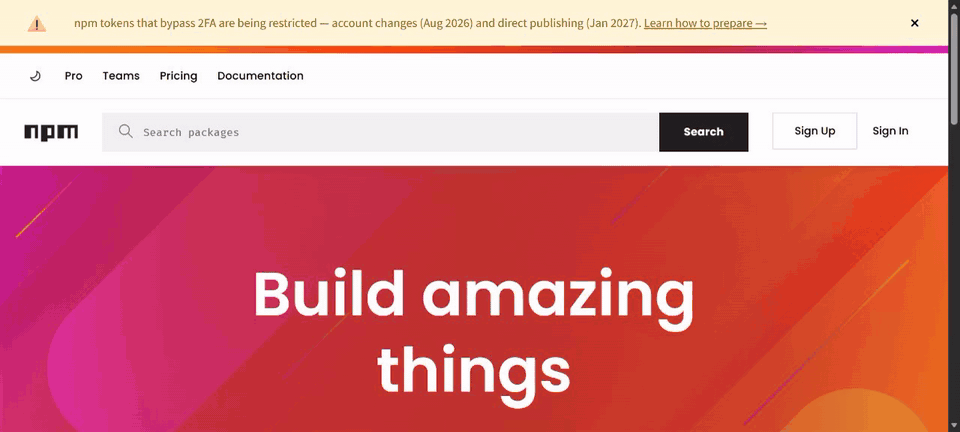

# agent-hands

**Human-rate hands for a real Chromium browser.** One you launched, the one you
are logged into, or an `agent-browser` session. It clicks, types and scrolls at
human rates. One CDP socket, a whole gesture dispatched at 60-100Hz, Fitts-law
motion with Bezier paths and lognormal keystroke timing.

It never moves your physical cursor and never raises the window.



Captured over CDP from the page itself, at real speed. The numbers behind
every claim here, and the way to reproduce them, are in
[docs/evidence.md](docs/evidence.md).

```bash
agent-hands snapshot                         # find the element, get @e1 @e2
agent-hands fill "#searchbox_input" "auto ecole vincennes"
agent-hands press Enter
agent-hands text h1                          # verify
```

## Why

`agent-browser hover` emits exactly one `mousemove` that teleports to the
target. Driving its `mouse move` from the shell lands events ~570ms apart,
because each call spawns a process — geometrically plausible, temporally
impossible. Behavioural scoring reads both as automation.

`agent-hands` holds one socket and paces the gesture itself:

| Gesture | agent-browser | agent-hands |
|---|---|---|
| move | 1 event, teleport | 25 events, median gap 16ms |
| click | instant | Bezier arc, overshoot + correction, 72ms dwell |
| type | — | dwell 62ms, flight 109ms |
| scroll | — | wheel-like bursts with pauses |

Human reference: 60-125Hz sampling, 50-100ms dwell, 100-200ms flight.
Measured on 15 Sep 2026: median gap 16.7 ms, click dwell 67 ms, key dwell
58 ms, flight 134 ms ([docs/evidence.md](docs/evidence.md)).

agent-browser's pull request #1810 adds curved `--human` mouse movement to
its own sessions. When it merges, the move and click rows will be re-measured
with the same probe. The typing model, the scroll model, and attaching to a
browser you did not launch are not in its scope.

## What it touches, and what it does not

- One CDP socket. It sends input events and reads the DOM. Nothing else.
- Credentials never appear in argv or in output. They arrive through
  `--email-env`, `--password-env` or stdin, and are typed, not logged.
- The physical cursor never moves. The window is never raised.
- On your own browser it holds one approved connection in a relay and writes
  an audit line per command. `agent-hands audit` prints them.
- It refuses when a click would be wrong: a covered target, a form container
  instead of a field, a sign-in page while `navigator.webdriver` is set.
- It is not a cloak. One detector reporting green, measured in
  [docs/evidence.md](docs/evidence.md), says nothing about Turnstile or
  DataDome, which score account history and IP as well. `--pause-on-challenge`
  hands those to you.

## When to reach for it

Escalate. Do not start here.

1. **Throwaway browser** — `agent-browser --session scratch open <url>`, no
   profile, no logins. Public pages, research, scraping. Most work belongs here,
   and `agent-browser click` is faster on it.
2. **Logged-in profile** — only when the task needs a real account.
3. **agent-hands** — only when 2 applies and the site can ban that account.

On a throwaway session this buys nothing. There is no account to lose.

## Install

```bash
npm i -g agent-hands
agent-hands doctor          # what this machine has, and whether a browser is reachable
```

Requires Node 22 or newer for the built-in `WebSocket`, and a Chromium browser
(Edge, Chrome, Brave or Chromium). No npm dependencies.

Two other tools are optional. `doctor` reports whether each one is present.

| Tool | What it unlocks | Without it |
|---|---|---|
| [agent-win](https://github.com/yassiEmp/agent-win), Windows only, `pip install agent-win` | clicks the "Allow remote debugging?" prompt for you; `login --window` | you click Allow once per browser run; `login --window` refuses and says why |
| [agent-browser](https://github.com/vercel-labs/agent-browser) | pooled throwaway sessions via `--session` | `agent-hands launch`, `--browser` or `--cdp` |

First run with nothing else installed:

```bash
agent-hands launch https://example.com     # starts a browser with the right flags, prints its port
agent-hands snapshot --cdp <port>          # see the page, get @e1 @e2
agent-hands click --ref @e3 --cdp <port>   # act on what you saw
```

## Commands

```
click --ref @e12          click <selector>           click --text "Label"
click --xy 420 300        hover <selector>           move --xy 200 400
fill <target> "text"      fill … --append            type "text"
press Enter --times n     scroll 600                 where
doctor                    skills get core [--full]
```

`--ref` takes a ref from `agent-hands snapshot`. It is the most robust
target and the only one that reaches inside a cross-origin iframe.
`fill` replaces the field's contents. Set `AGENT_HANDS_SESSION` to skip
`--session` on every call.

Flags: `--session <name>` (default `work`), `--browser <name>`,
`--user-data-dir <path>`, `--cdp <port|url>`, `--tab <match>`, `--no-activate`,
`--speed 1.6` brisk / `0.7` slow, `--json`, `--quiet`.

Exit codes: `0` dispatched, `1` runtime failure, `2` usage error.

## Your own browser

Chrome and Edge 144+ expose remote debugging without `--remote-debugging-port`.
Open `chrome://inspect/#remote-debugging` or `edge://inspect/#remote-debugging`,
tick **Allow remote debugging for this browser instance**, then:

```bash
agent-hands doctor --browser edge
agent-hands fill "#search" "hello" --browser edge --tab gmail
```

No restart, no lost tabs, and your logins are already there.

Browsers: `chrome`, `chrome-beta`, `chrome-dev`, `chrome-canary`, `edge`,
`edge-beta`, `edge-dev`, `edge-canary`, `chromium`, `brave`, `vivaldi`, on
Windows, macOS and Linux. Any other Chromium build works with
`--user-data-dir <path>`.

`--tab` matches a title or url. An unmatched value lists what is open. Without
it the first command picks the visible tab and remembers it, so later commands
return to that tab even after you switch away. `agent-hands tabs` shows which
tab commands go to. `open` on an attached browser creates a new background tab,
so the page you are reading is never navigated away; `--here` navigates the
current tab instead.

That endpoint serves no `/json/*` routes, so nothing can discover targets over
HTTP. They are read over the browser websocket with `Target.getTargets` instead,
which works on both endpoint styles. Pooled sessions keep the per-page socket
exactly as before.

The uuid on line 2 of `DevToolsActivePort` is mandatory here, and it **changes
every time the toggle is switched**. A stale uuid times out exactly like a
rejected one, so re-read the file rather than caching it.

### The prompt, and why it is answered for you

The browser asks you to authorize every new CDP connection, and that approval
cannot be persisted. Worse, it is drawn in the browser's own window chrome:
CDP cannot see it and cannot dismiss it, so the websocket upgrade **hangs** with
no error until somebody clicks. Clients with a short handshake timeout give up
first — `playwright-cli` abandons it after 30s.

Two mitigations. A small background relay holds the one socket, so you approve
once per browser run rather than once per command. And **if you separately install
[agent-win](https://github.com/yassiEmp/agent-win)**, the prompt is clicked for you
while the handshake is pending, so a connect needs no human at all.

agent-win is a Windows-only Python tool and is **not** a dependency of this
package — nothing installs it for you. It is found in this order:

1. `$AGENT_WIN` — an explicit command
2. `agent-win` on `PATH`
3. `python -m agent_win`, with `$AGENT_WIN_HOME` pointing at a git checkout

```bash
agent-hands doctor --browser edge                      # if agent-win is on PATH
AGENT_WIN_HOME=/path/to/agent-win agent-hands doctor --browser edge
```

A pip install puts `agent-win` on PATH and needs no environment variable at all.

Without it nothing breaks: the connect waits for you to click, and says so once
rather than hanging silently. `AGENT_HANDS_NO_APPROVE=1` disables it outright.
On macOS and Linux there is no such prompt, so none of this applies.

That approver works in any UI language. It finds the dialog by Chromium's
`MdTextButton` class, which is never translated, then picks the affirmative from
a table of the word "Allow" in ~30 languages. It deliberately refuses to guess:
the real dialog has three buttons — *Disable in settings*, *Allow*, *Cancel* —
and Allow is neither first nor last, so choosing by position would disable your
setting or refuse the connection. In an unlisted language it prints the buttons
it saw and waits for you.

One caveat worth knowing: the prompt names no requester, so the approver clears
**any** pending debugging prompt on the desktop. Do not run it while a
connection you did not start is waiting.

**Diagnosing a hang.** A clean `404` on `/json/version` means the server is up
and simply serves no `/json/*`. `EOF while parsing` means it is not answering at
all — a pending prompt or a rotated uuid. Sending an `Origin` header turns the
hang into a `403` naming `--remote-allow-origins`, which is a red herring:
omitting `Origin` is what works.

A hidden tab is driven where it is and your foreground never changes. A tab
frozen by the browser's memory saver cannot answer any command, so it is woken
by bringing it forward for a moment and your previous tab is restored straight
after. `Page.setWebLifecycleState` does not thaw a frozen tab and
`Emulation.setFocusEmulationEnabled` hangs on one, so activation is the only
route. `--no-activate` turns that flicker into an error instead.

`--ref` needs refs from `agent-hands snapshot`, which mints and stores its own
per browser. They work on `--browser` and `--cdp` targets too, and they are the
only target that reaches inside a cross-origin iframe.

Set `AGENT_HANDS_CDP` to skip `--cdp` on every call.

## For agents

```bash
agent-hands skills get core --full
```

Serves the versioned guide bundled with the installed CLI, so instructions
never drift from behaviour. `--json` gives one-line machine-readable results:

```json
{"ok":true,"command":"click","points":14,"ms":392,"overshoot":true,"tag":"BUTTON"}
{"ok":false,"error":"no element matched selector \"#nope\"","code":"ENOTFOUND"}
```

## Sessions

A session name pairs to one Chrome profile: `work` -> `main`, `work-2` ->
`main-2`. Chrome locks a profile directory, so one browser per profile. Give
each parallel agent its own session.

## Limits

Does not defeat Cloudflare Turnstile, DataDome, or PerimeterX — those combine
behaviour with canvas, WebGL and TLS fingerprinting. `'webdriver' in navigator`
still returns `true`; hiding its value is the browser's init script, not this.

## License

MIT
