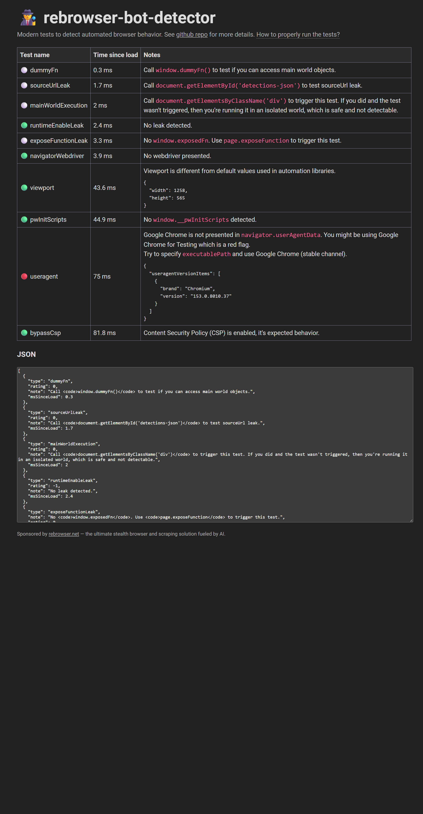

# Evidence

What the page sees when agent-hands drives it, measured on 15 Sep 2026, and
how to run the same measurement yourself. Numbers are from one machine and
one browser. They are not a guarantee. See "Limits" before quoting any of it.

## Setup

- Windows 11, Edge 153 (Chromium 153.0.8010.37), launched by
  `agent-hands launch --profile evidence`, so with
  `--disable-blink-features=AutomationControlled` and a classic
  `--remote-debugging-port`.
- agent-hands 0.17.1, default `--speed 1`.
- The probe page is `docs/assets/measure.html`. It records every pointer,
  key and wheel event with `performance.now()` and prints the statistics into
  `#stats`, which `agent-hands text "#stats"` reads back. Nothing in the page
  knows which tool is driving it.

## Input cadence, agent-hands

The commands, in order, on the probe page:

```bash
agent-hands click "#target"                    --cdp <port>
agent-hands fill "#field" "human rate typing"  --cdp <port>
agent-hands hover "#scroller"                  --cdp <port>
agent-hands scroll 600                         --cdp <port>
agent-hands text "#stats"                      --cdp <port>
```

What the page recorded:

| Gesture | Measured | Human reference |
|---|---|---|
| move to the button | 27 mousemove events over 416 ms, median gap 16.7 ms, p90 16.8 ms | 60 to 125 Hz sampling (8 to 16 ms) |
| path shape | 462 px travelled for a 435 px straight line (straightness 0.94), with an overshoot and correction | curved, not straight |
| click | mousedown to mouseup 67 ms | 50 to 100 ms |
| typing, 17 characters | key dwell median 58 ms, flight median 134 ms, flight p90 302 ms | dwell 50 to 100 ms, flight 100 to 200 ms |
| scroll 600 px | 0 wheel events; the page scrolled in eased steps | see Limits |

The 16 ms gap is one display frame. Every move here is dispatched at frame
rate on one socket. The p90 equals the median because the pacing is a timer,
not a queue: nothing waits on a round trip.

## Bot detector

`https://bot-detector.rebrowser.net/` opened by `agent-hands launch`, then
read with `agent-hands snapshot` and `agent-hands text body`, which is every
way this tool touches a page. The table it printed afterwards:

| Test | Result |
|---|---|
| runtimeEnableLeak | green, no leak detected |
| navigatorWebdriver | green, no webdriver presented |
| viewport | green, not a default automation viewport |
| pwInitScripts | green, none |
| bypassCsp | green, CSP intact |
| useragent | red: "Google Chrome is not presented in navigator.userAgentData". The browser is Edge. The test expects Chrome. |
| dummyFn, sourceUrlLeak, mainWorldExecution, exposeFunctionLeak | not triggered. They fire only when the automation calls a trap function; agent-hands never does. |



## Limits

- **One detector is not a cloak.** Turnstile, DataDome and PerimeterX score
  dozens of other signals, including IP reputation and account history, and
  will still challenge. agent-hands has `--pause-on-challenge` for exactly
  that case. Do not read this page as "undetectable".
- **The useragent row is red on Edge.** On Chrome it is expected to be green;
  not measured here.
- **Scroll dispatches no wheel events.** `scroll` moves `window.scrollY` in
  eased steps of 90 to 190 px at 16 ms frames with 70 to 260 ms pauses. A
  page watching `scroll` events sees human-like stepping. A page watching
  `wheel` events sees nothing. Real wheel input over CDP is an open item.
- **Not re-measured today: agent-browser.** The README's comparison rows for
  agent-browser (one teleporting mousemove per hover, about 570 ms between
  shell-driven moves) were measured by the owner during development.
  Re-measuring on 15 Sep 2026 did not complete: `agent-browser open` hung on
  this machine in both 0.27.0 and 0.37.1. agent-browser's pull request #1810
  adds curved `--human` movement for its own sessions; when it merges, this
  page should measure it with the same probe.
- **One machine, one run.** Timings vary with `--speed` and with the
  lognormal draws. The medians are stable across runs; the tails are not.

## Verify it yourself

```bash
npm i -g agent-hands
git clone https://github.com/yassiEmp/agent-hands
cd agent-hands
agent-hands launch "file://$PWD/docs/assets/measure.html" --profile probe   # prints the port
agent-hands click "#target" --cdp <port>
agent-hands fill "#field" "human rate typing" --cdp <port>
agent-hands text "#stats" --cdp <port>
agent-hands open https://bot-detector.rebrowser.net/ --here --cdp <port>
agent-hands snapshot --cdp <port>
agent-hands text body --cdp <port>
```

`node docs/assets/screencast.mjs shot <port> detector.png` takes the
screenshot over CDP: it captures the page, nothing else on the screen.
